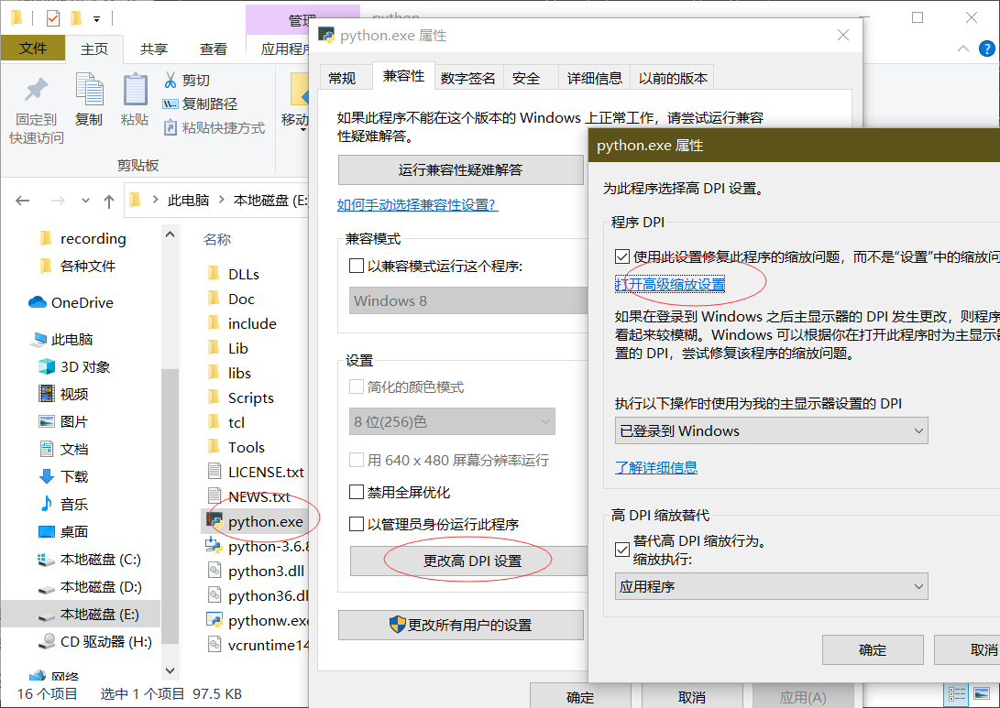
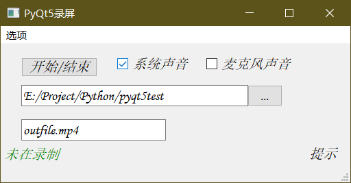

# 某无良大二学生抄的核心代码加的壳

### 用于录屏

运行命令

```powershell
python MainWindow.py
```

### 运行前必读

要pip以下第三方库，否则可能不能运行

pyqt5、numpy、sounddevice、soundfile、PIL、scipy等等，这些如果没有看看报错就能pip安装。比较麻烦的是要安装这两个东西，一个是pyaudio库[参考博文](https://blog.csdn.net/zhl555666/article/details/82947654)先从[这个](https://github.com/intxcc/pyaudio_portaudio)或者[这个](https://github.com/intxcc/pyaudio_portaudio/releases)下载轮子(.whl文件)，然后到你轮子文件目录下执行 

```powershell
python.exe ./setup.py install --static-link
```

命令，才能安装上(安装完成之后import一下试试)

另一个东西是ffmpeg，用来操作视频音频文件的。先去[官网](https://ffmpeg.zeranoe.com/builds/)下build，完了之后把bin目录添加环境变量这都没的说的，[参考博文](https://www.cnblogs.com/GarsonZhang/p/10526880.html)

上面的东西搞完之后就可以运行MainWindow.py了

还有一个可能出现的问题是windows系统可能会出现右下角录制为黑色的问题。参考stackflow上的解决办法打开python安装目录，右击选择属性-更改高DPI设置-打开高级缩放设置，然后给缩放调成100%，注销重新登陆就可以（可能感觉起来会变得很小，反正不知道咋我后来又调回去之后就没有黑边了）

### 功能

如同界面一般简单

-   只支持单次录制(主要是我不知道咋把线程关了)，就是你点了开始又点了结束(对没错同一个按键)之后再点开始就崩溃了。也就是说想再录一次就重新运行程序(话说为啥我不让他直接退了呢)

-   可以录制系统声音和麦克风声音，如果不录声音后来视频速度可能会莫名变快所以不建议这样做。

-   提示还没实现，就看这个MarkDown就够了。

-   想用pyinstaller打包成EXE文件的来着，但是可能是因为ffmpeg没法打包进来的原因，最后能执行但是视频音频没法合成。如果想尝试的童鞋给你们俩思路，一个是把ffmpeg包拷贝到打包好的目录底下，另一个是把源码record.py中FFmpegThread类下最后几行的删除avi与wav文件注释掉，然后你在命令行下用ffmpeg把这若干个文件拼接起来就行。

# 以上

如果以后想起来完善功能比如按键绑定啥的那再说

# 放一段视频

<video id="video" controls="" preload="none" > <source id="mp4" src="test.mp4" type="video/mp4"> </video>